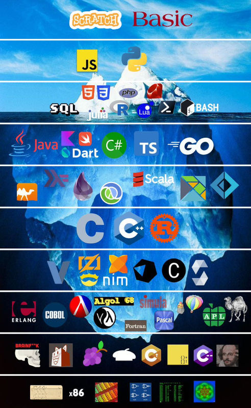
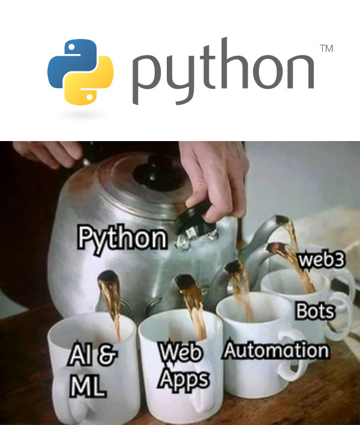
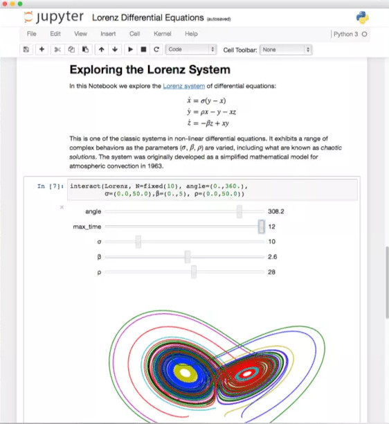

# Uso de Bases de Datos con Python

Mayo 2023

---

# Guillermo Valdés (@guivaloz)

- Ingeniero Mecánico Administrador
- Director de Informática en PJECZ.gob.mx
- Científico de datos
- Fedora GNU/Linux
- Python, Javascript, PostgreSQL, etc.
- Certificaciones en Google Cloud
- Astronomía y videojuegos

---

# Contenido

- Bases de datos y SQL
- Lenguajes de programación, destacando Python
- APIs
- Jupyter Notebooks y Ciencia de Datos
- Open Source, Git y GitHub
- Pasos para empezar
- Retos en el presente y futuro

---

# El valor de los datos

En mayo de 2017, The Economist publicó un artículo titulado:

*"The world's most valuable resource is no longer oil, but data."*

El recurso más valioso del mundo ya no es el petróleo, sino los datos.

---

# Consumo personal de datos

- Consultar unas cuantas páginas web: 1 MB
- Descargar una fotografía: 5 MB
- Escuchar una hora de música en **Spotify**: 50 MB
- Una hora de **TikTok** en calidad media: 600 MB
- Una hora de **YouTube** en calidad media: 1 GB
- Una película HD en **Netflix** de 2 horas: 4 GB

---

# En 2022 se generó 97 zettabytes de datos

- Fotos en Facebook: 147,000 por minuto
- Búsquedas en Google: 2.4 millones por minuto
- Mensajes de WhatsApp: 41.6 millones por minuto
- Correos electrónicos: 3 millones por segundo

Se estima que en **2025** se generarán **175 zettabytes** de datos.

<!--
Byte, Kilo Byte, Mega Byte, Giga Byte, Tera Byte, Peta Byte, Exa Byte, Zetta Byte, Yotta Byte, Brono Byte
-->
---

# Bases de datos

Es un conjunto de datos estructurados bajo un mismo contexto. También involucra la administración de grandes volúmenes de información.

Entre los sistemas de administración de bases de datos **relacionales** más populares están **Microsoft SQL Server**, **PostgreSQL**, **MySQL** y **SQLite**.

---

# Sistemas de gestión de información

Las bases de datos suelen funcionar en servidores con generosas cantidades de memoria RAM y almacenamiento en disco.

Los **Sistemas de Gestión de Información** *(Information Management System)* son programas que permiten administrar bases de datos.

Con éstas, los usuarios pueden crear, modificar y eliminar datos, así como realizar consultas.

---

# SQL

Una **base de datos** es un programa que permite almacenar y recuperar datos de manera eficiente.

Uno de los tipos de bases de datos más populares son las **relacionales**.

El **SQL** es un lenguaje que permite interactuar con bases de datos relacionales.

---

# Lenguajes de programación

Un requisito para trabajar con bases de datos es conocer un lenguaje de programación que sea capaz de interactuar con éstas.

Hay muchos lenguajes que pueden hacerlo, pero los más populares son **Python**, **Javascript**, **PHP**, **Java** y **C#**.

Nos enfocaremos en **Python** por su popularidad y facilidad de uso.

---

# Datos abiertos

Los **datos abiertos** son datos que pueden ser usados, reutilizados y redistribuidos libremente por cualquier persona.

Han de ser fiables, estructurados, documentados y fácilmente accesibles.

Pueden ser generados por el gobierno, empresas privadas, organizaciones no gubernamentales, etc.

Los fines son diversos, pero suelen ser para la toma de decisiones, la investigación, la transparencia y para lograr sinergia entre ciudadanos, instituciones y empresas.

---

# Archivos de datos

También debemos trabajar con archivos de datos que no están en una base de datos, sino en archivos de texto.

Particularmente el tipo de archivo **CSV** *(Comma Separated Values)* es el más común para compartir datos porque podemos trabajar directamente con éste o importarlo a una hoja de cálculo o a una base de datos.

- Deben usar sólo caracteres ASCII y estar mayúsculas.
- Con la codificación de caracteres UTF-8.
- Fechas en formato ISO 8601 (YYYY-MM-DD).
- Con información desagregada.

---

# APIs

Un **API** *(Application Programming Interface)* es un conjunto de funciones que permite a diferentes aplicaciones comunicarse entre sí y compartir información. Existen APIs públicas y de pago.

En el presente, la mayoría de las APIs utilizan el formato **JSON** *(JavaScript Object Notation)* para intercambiar información.

---

# Python

**Python** es un lenguaje de programación de alto nivel, interpretado, orientado a objetos y de propósito general.

Tiene gran popularidad en el mundo de la **ciencia de datos** y el **aprendizaje automático.**

Una de sus ventajas es que hay miles de librerías que permiten realizar tareas específicas, prácticamente para cualquier cosa.

---

# Jupyter Notebooks

Un **Jupyter Notebook** es un documento que permite combinar texto, código y resultados en un solo lugar. Trabaja en el navegador web y es muy usado por la comunidad científica.

---

# Ciencia de Datos

La **Ciencia de Datos** es un campo interdisciplinario que involucra métodos científicos, procesos y sistemas para extraer conocimiento o un mejor entendimiento de datos en sus diferentes formas.

En otras palabras, es el saber usar las herramientas adecuadas para encontrar patrones en los datos o "pepitas de oro".

---

# Open Source

Le debemos mucho a la comunidad de **software libre** y **código abierto** el rápido avance en la informática.

Como conocimiento colectivo hay lenguajes de programación (como **Python**), software de bases de datos (como **PostgreSQL**), sistemas operativos (como **GNU/Linux**), etc.

---

# Git y GitHub

**Git** es el software creado por **Linus Torvalds** que permite llevar un control de versiones de los archivos de código fuente.

Su principal característica es que permite trabajar a muchas personas en un proyecto de manera distribuida.

**GitHub** es un servicio en la nube que permite almacenar repositorios de Git y colaborar con otros desarrolladores.

---

# Para empezar

1. Dominar SQL
2. Aprender varios lenguajes de programación
3. Aprender Python y conocer sus librerías
4. Descargar y trabajar con datos abiertos
5. Consultar con APIs
6. Hacer ciencia de datos con Jupyter Notebook
7. Tener cuenta en GitHub y aportar a proyectos

---

# Uso de Python con bases de datos

- **SQLAlchemy** es una librería que permite trabajar con bases de datos relacionales.
- **Pandas** es una librería que permite trabajar con datos en general.
- **Jupyter** es un entorno de trabajo para ciencia de datos.
- **FastAPI** es un framework para crear APIs rápidamente.
- **Requests** es una librería para hacer peticiones HTTP.
- **BeautifulSoup** es una librería para extraer datos de páginas web.

---

# Otros softwares para trabajar con datos

- **PostgreSQL** es un sistema de gestión de bases de datos relacionales.
- **pgAdmin** es un software para administrar bases de datos PostgreSQL.
- **DBeaver** es un software para administrar bases de datos relacionales.
- **SQLite** es un sistema de gestión de bases de datos relacionales.
- **GNU/Linux** es un sistema operativo de código abierto.

---

# Tendencias en 2023

- Tecnologías verdes en crecimiento
- Hiperconectividad y ciber-resilencia
- Computación cuántica
- Edición genética aplicada
- Inteligencia artificial en todas partes

---

# Gracias

- GitHub https://github.com/guivaloz
- Movimiento Libre https://movimientolibre.com
- PJECZ https://www.pjecz.gob.mx
- Twitter @guivaloz
